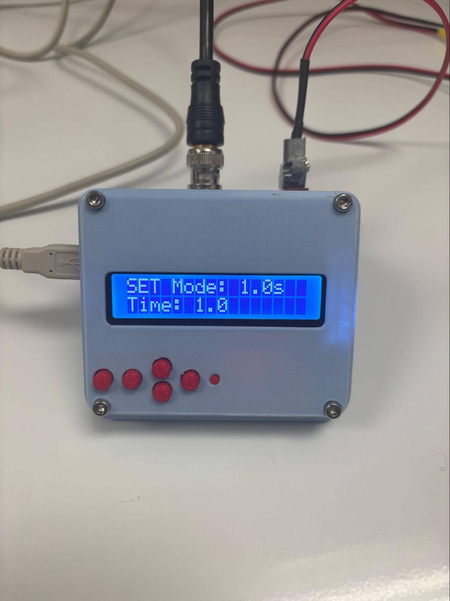

General Purpose TTL Timer
===========

TTL trigger timer for working with light sources for animal behavioral tests.

_Protocol written by Valeriia Ustymenko_


## Operation

```
Keypaad schematic:

       |3|
|1| |2|    |5|
       |4|
```

1 - Emergency stop
2 - Time setting mode (1.0s or 0.1s)
3 - Increase time
4 - Decrease time
5 - Timer start/stop

Push-button works the same as button 5: 1 press to start, 2 presses to stop.

Press button 5 to reset the timer between measurements.

## Preparation of the system for tests
For optogenetic test were used a system in such configuration was, as pictured in figure below: 


*All equipment, needed for optogenetic test*

1. The Doric LDFLS_450/075_520/060 requires a 12V DC power supply. Plug in a cable in power adapter for laser diode fiber light source (Doric, LDFLS_450/075_520/060).
2. Locate the 12V DC power input on the back or side of the laser diode fiber light source (Doric, LDFLS_450/075_520/060).
3. Use a BNC cable to connect the TTL signal source to the laser's TTL input for laser diode #1, 450 nm. Ensure that you properly secured it by rotating connector.


4. Check for dust or debris on the fiber tip of optical fiber. Align the fiber connector with the 450 nm laser output port. Gently insert the fiber into the port without forcing it. Rotate clockwise until snug. Do not overtighten, as this can damage the fiber or connector.


__Note: Detailed description of the Doric LDFLS setup is not provided here!__

5. Use a BNC cable to connect the the laser's TTL input for laser diode #1, 450 nm to TTL timer (Arduino-UNO compatible board with LCD-keypad shield in a very beautiful blue plastic box!). Ensure that you properly secured it by rotating connector.


6. Plug in a cable that connects the TTL timer  to a push button mounted on a 15 mL centrifuge tube.


7. Plug a DC power adapter into the Arduino’s power jack. The power LED on the Arduino should turn on. Use a regulated power supply to prevent damage. 


8. Set a mode on the TTL timer by pushing the second red button from the left. Two main modes differ in such a way: 1.0 s mode allows to set max explosion time by seconds, and 0.1s mode - 100 milliseconds. 

|                    1.0s Mode                    |                   0.1s Mode                    |
| :---------------------------------------------: | :--------------------------------------------: |
|  |  |

10. Set the max time of exposing the hind paw by pushing the third buttons from left, or middle buttons. We choose max one second exposition to prevent misinterpretation due to thermal stimulation rather than optical activation. The minimal possible exposition is 0.2 seconds.

11. Check the correctness of working of all components of the system by pushing a push button mounted on a 15 mL vial. Do not orient the laser to the eyes!


-----

## STL Models
The following models from open sources were used in this project:

- [Case for Arduino Uno, LCD Keypad Shield and Stepper Motor Driver by AndreySamokhin on Thingiverse](https://www.thingiverse.com/thing:4194107)
- [Arduino UNO Case](https://www.printables.com/model/244590-arduino-uno-case-with-m3-screwsnuts-and-hexagonal-) and [LCD Keypad Shield Case](https://www.printables.com/model/244258-arduino-lcd-keypad-shield-snap-fit-case) from [@jacek on Printables](https://www.printables.com/@jacek)

